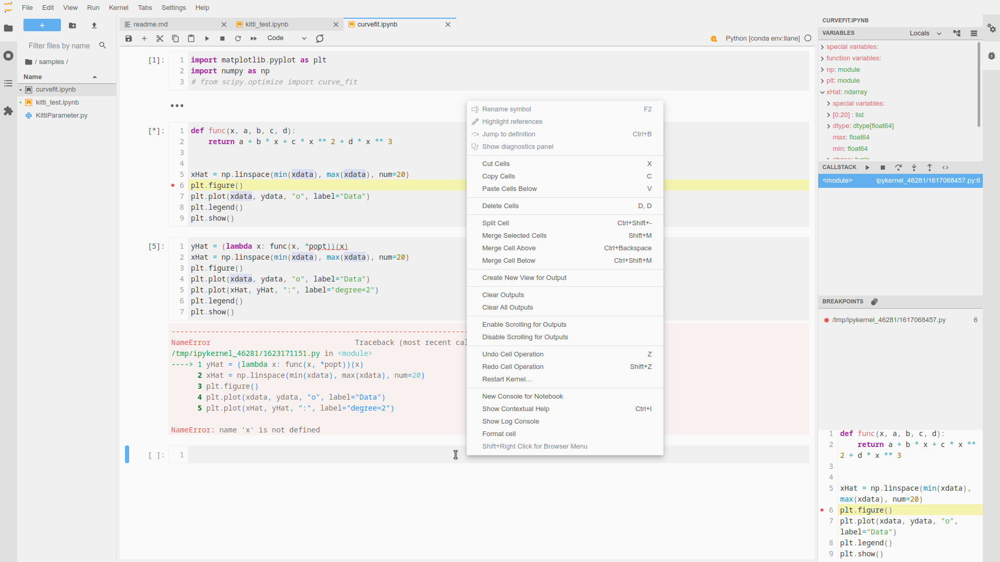

# Atom One Light Theme for Jupyter Lab

Inspired by [VSCode Atom One Light](https://github.com/akamud/vscode-theme-onelight) which is base on [Atom's One Light theme](https://github.com/atom/one-light-syntax).

This project is under development. Many styles are not finished yet. Only test JupyterLab 3.2.8 in Chrome 79 and Edge 79.



## Install

```shell
git clone https://github.com/kuzen/jupyterlab-atom-one-light
cd jupyterlab-atom-one-light
npm install
jupyter labextension install .
```

To enable theme scrollbars:  

> Settings -> Jupyterlab Theme -> Theme Scrollbars


## Ref  

<https://github.com/jupyterlab/jupyterlab/blob/master/packages/theme-light-extension/style/variables.css>

<https://github.com/atom/one-light-ui>

<https://github.com/DavidZhang73/jupyterlab-atom-one-dark-theme>

<https://github.com/akamud/vscode-theme-onelight>

<https://code.visualstudio.com/api/references/theme-color#editor-widget-colors>
